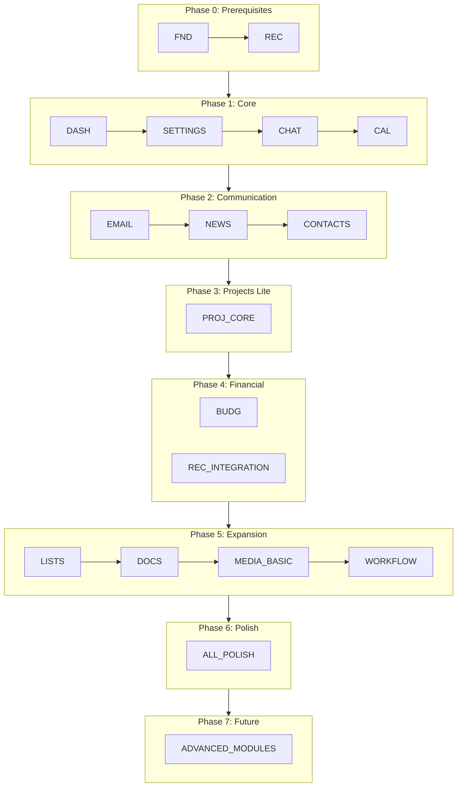

# Prioritized Build Plan for the AI Command Center Frontend

Based on the assessment, a strategic **phased approach** is essential to deliver a functional core while allowing for incremental enhancements. The following plan organizes all tasks into logical phases, respecting dependencies and business value.

---

## Phase 0 – Critical Prerequisites
**Goal:** Set up shared infrastructure, tooling, and the design system. Without this, no other module can function.

| Order | Task ID | Description |
|-------|---------|-------------|
| 0.1 | FND-001 | Vite + TypeScript scaffold (if not already done) |
| 0.2 | FND-000 | Design tokens, CSS-first theme system, motion tokens |
| 0.3 | FND-002 | Install all core dependencies (Tailwind, shadcn, Zustand, TanStack Query, etc.) |
| 0.4 | FND-004 | Testing infrastructure (Vitest, RTL, MSW, test helpers) |
| 0.5 | FND-005 | Zustand store architecture (shared patterns, slices) |
| 0.6 | FND-006 | TanStack Query configuration, `useOptimisticMutation` wrapper |
| 0.7 | FND-003 | Code quality (ESLint, Prettier, Husky) |
| 0.8 | FND-007 | React Router v7 setup with lazy routes |
| 0.9 | REC-000 | Shared recurrence engine (required by Calendar, Budget, Projects) |
| 0.10 | REC-001 | RecurrenceEditor component |

**Exit criteria:** Vite dev server runs, theme tokens are applied, global providers wrap the app, skeleton pages render, tests pass.

---

## Phase 1 – Core Foundation Modules
**Goal:** Deliver the primary workspace components that form the backbone of the command center.

### 1.1 Dashboard (DASH‑000 through DASH‑005)
The landing page that ties agents and activities together. Essential for user engagement.

| Tasks | Rationale |
|-------|-----------|
| DASH-000, DASH-001 | Domain, mock data, hooks |
| DASH-002, DASH-003, DASH-004, DASH-005 | Layout, status banner, agent cards, activity feed |
| *Defer DASH‑006 (AttentionQueue) and DASH‑007 (Drawer)* | Can be added later |

### 1.2 Settings (SET‑000 through SET‑002)
Users expect theme, appearance, and notification controls early.

| Tasks | Rationale |
|-------|-----------|
| SET-000 | State & persistence |
| SET-001 | Page shell & navigation |
| SET-002 | Core settings forms (appearance, general) |
| *Defer API keys, integrations, danger zone* | |

### 1.3 Chat (CHAT‑001 through CHAT‑007, CHAT‑010)
The primary AI interaction surface. Include basic streaming and UI, defer complex features.

| Tasks | Rationale |
|-------|-----------|
| CHAT-001, CHAT-002 | Layout, state, query config |
| CHAT-003, CHAT-004, CHAT-005, CHAT-006, CHAT-007 | Thread list, message bubbles, virtual scroll, input, streaming |
| CHAT-010 | Checkpoint banner |
| *Defer canvas, artifacts, MCP, knowledge base, A2A Flow* | Those are expansion features |

### 1.4 Calendar (CAL‑000 through CAL‑002, CAL‑008, CAL‑009, CAL‑010)
Basic calendar views and event management.

| Tasks | Rationale |
|-------|-----------|
| CAL-000 | Mock data |
| CAL-001 | State & page layout |
| CAL-002 | Multi‑Calendar Support & Calendar List Sidebar |
| CAL-008 | Event composer |
| CAL-009, CAL-010 | Month, week/day views |
| *Defer recurring, attendee, resource views, import/export, audio, etc.* | |

**Exit criteria:** A user can log in, see their agent dashboard, send/receive AI chat, adjust theme settings, and view/manage basic calendar events.

---

## Phase 2 – Communication & Personal Productivity
**Goal:** Add email and basic content management, turning the command center into a daily driver.

### 2.1 Email (EMAIL‑000 through EMAIL‑003)
Unified inbox, reading pane, compose.

| Tasks | Rationale |
|-------|-----------|
| EMAIL-000, EMAIL-001, EMAIL-002, EMAIL-003 | Domain, state, layout, basic interaction |
| *Defer advanced rules, templates, AI features, integrations* | |

### 2.2 News (NEWS‑000 through NEWS‑006)
Personalized news feed with reader mode.

| Tasks | Rationale |
|-------|-----------|
| NEWS-000, NEWS-001, NEWS-002, NEWS-003, NEWS-004, NEWS-005, NEWS-006 | Full feed up to reader mode |
| *Defer search, audio summaries* | |

### 2.3 Contacts (CONT‑000 through CONT‑003)
Basic contact list and detail view.

| Tasks | Rationale |
|-------|-----------|
| CONT-000, CONT-001, CONT-002, CONT-003 | Domain, state, layout, fields |
| *Defer relationship mapping, workflow, enrichment* | |

**Exit criteria:** Users can read emails, browse articles, and manage contacts without leaving the app. The foundation for linking these items to projects is ready.

---

## Phase 3 – Project Management Lite
**Goal:** Introduce task/project tracking that integrates with agents and calendar. Select only essential MVPs from the enormous `20‑Projects` spec.

### 3.1 Projects Core (PROJ‑000 through PROJ‑009)
List view, Kanban, detail page, task list.

| Tasks | Rationale |
|-------|-----------|
| PROJ-000, PROJ-001, PROJ-002, PROJ-003, PROJ-004, PROJ-008, PROJ-009 | Mock data, state, layout, list view, Kanban, detail, task list |
| *Defer Timeline, My Week, Workload, Quick Peek, Templates, Recurring, Automations, Saved Views, External Tasks, Document Panel* | These are power-user features |
| *Defer PROJ-010 (Task Drawer) – implement inline editing first* | Reduce complexity |

### 3.2 Integration Points
- Embed `useProjectTasks()` view into Dashboard ActivityFeed or Triage (later).
- Link Chat messages to project tasks via metadata.

**Exit criteria:** A user can create projects, manage tasks in a Kanban board, and link them to agents. This provides the “command” backbone.

---

## Phase 4 – Financial Calendar & Recurring Mastery
**Goal:** Deliver the Budget module with its core financial calendar paradigm, leveraging the Shared Recurrence engine.

### 4.1 Budget (BUDG‑000 through BUDG‑006, BUDG‑010)
The transactions workspace, overview dashboard, and recurring calendar.

| Tasks | Rationale |
|-------|-----------|
| BUDG-000, BUDG-001, BUDG-002, BUDG-003 | Domain, data, state, route |
| BUDG-004, BUDG-005, BUDG-006 | Overview, planner, transactions with calendar view |
| BUDG-010 | Recurring page & cash flow forecast (uses shared recurrence) |
| *Defer goals, accounts, reports, offline, AI insights* | |

### 4.2 Enhanced Recurring for Calendar & Projects
- Apply shared recurrence engine to Calendar (CAL‑013) and Projects (PROJ‑013) in this phase.

**Exit criteria:** Users can plan their finances on a calendar, manage recurring bills, and forecast cash flow. Calendar events and project tasks have full recurrence capabilities.

---

## Phase 5 – Expansion & Power Tools
**Goal:** Add differentiated features that elevate the product but are not essential for launch.

### 5.1 Lists (LIST‑002, LIST‑003, LIST‑004)
Quick capture and nested checklists.

### 5.2 Documents (DOC‑002, DOC‑003, DOC‑004, DOC‑005, DOC‑008)
Bidirectional linking and OCR (simplified).

### 5.3 Advanced Chat Features
- CHAT-011 (Canvas editor) and CHAT-012 (Live Artifacts) if resources allow.

### 5.4 Media Library (MEDIA‑000 through MEDIA‑003, MEDIA‑005)
Basic media management and albums.

### 5.5 Workflow (FLOW‑000, FLOW‑001)
Visual canvas for workflow building, complementing A2A orchestration.

**Exit criteria:** The platform extends into content creation and automation, moving beyond a pure dashboard.

---

## Phase 6 – Polish, Validation & Enterprise Readiness
**Goal:** Harden the application for production.

| Task Group | Tasks |
|------------|-------|
| Settings completeness | SET-003 (API keys), SET-004, SET-006 (Danger Zone), SET-007 |
| Polish & Validation | POL-001 (Performance), POL-002 (Testing gates), POL-003 (Analytics, Audit & RUM), POL-004 (Production hardening), POL-005 (UX polish), POL-006 (Security) |
| Advanced Budget | BUDG-008 (Goals), BUDG-009 (Accounts), BUDG-011 (Reports), BUDG-013 (Financial Home) |
| Advanced Projects | Triage inbox (PROJ-018‑PROJ-020), Automations (PROJ-017), Practice Intelligence (PROJ-024) |
| Cross-module RAG | CHAT-018 (Knowledge base) and CHAT-019 (Memory) after core modules are stable |

**Exit criteria:** Application passes Lighthouse thresholds, zero axe violations, works offline, all critical user journeys are tested, security review complete.

---

## Phase 7 – Future / Stretch
**Goal:** Modules that are speculative, high-effort, or require significant backend infrastructure not yet mocked.

- **Translation** (33‑Translation)
- **Conference** (32‑Conference)
- **Research** (42‑Research)
- **Media AI tools** (MEDIA‑014–MEDIA‑034)
- **Contacts social / workflows** (CONT‑014–CONT‑027)
- **A2A Flow Orchestrator** (CHAT‑021) – real visual agent chaining
- **MCP Integration** (CHAT‑015) – when protocol matures

---

# Implementation Sequence Summary



---

## Immediate Next Steps
1. **Regenerate `41‑Documents.md`** from a clean source (corrupted file).
2. **Create a global dependency map** linking modules to shared infrastructure.
3. **Define MVP scope contract:** freeze features exactly as described in Phase 1 and 2.
4. **Update task specs to remove duplicated recurrence logic** (apply REC‑002 to REC‑005).

Below is a comprehensive repository blueprint reflecting the finished Personal AI Command Center Frontend as described by all the task specifications. The structure mirrors the conventions established in the specifications (`src/components/<module>/`, `src/queries/`, etc.) and includes every major functional area. Shadcn UI generated components reside in `src/components/ui/`, though only a representative entry is shown for brevity.

```
ai-command-center/
├── .env.example
├── .gitignore
├── .prettierrc
├── .prettierignore
├── components.json                  # shadcn/ui configuration
├── eslint.config.js
├── index.html
├── lint-staged.config.js
├── package.json
├── pnpm-lock.yaml
├── README.md
├── tsconfig.json
├── vite.config.ts
├── vitest.config.ts
├── playwright.config.ts
├── lighthouserc.js
├── .pa11yci.json
├── .husky/
│   └── pre-commit
├── public/
│   ├── manifest.json
│   ├── robots.txt
│   ├── sitemap.xml
│   └── service-worker.js
└── src/
    ├── main.tsx
    ├── App.tsx
    ├── index.css
    ├── vite-env.d.ts
    ├── auth/                                         # Auth & session
    │   └── ... (auth context, guards)
    ├── components/
    │   ├── ui/                                       # shadcn/ui primitives (button, dialog, etc.)
    │   ├── theme-provider.tsx
    │   ├── theme-toggle.tsx
    │   ├── ErrorBoundary.tsx
    │   ├── GlobalErrorFallback.tsx
    │   ├── SkipLink.tsx
    │   ├── layout/
    │   │   ├── AppShell.tsx
    │   │   ├── Sidebar.tsx
    │   │   ├── NavItem.tsx
    │   │   ├── StatusBar.tsx
    │   │   ├── RightPanel.tsx
    │   │   ├── CommandPalette.tsx
    │   │   └── VoiceShell.tsx
    │   ├── dashboard/
    │   │   ├── AmbientStatusBanner.tsx
    │   │   ├── AgentFleetPanel.tsx
    │   │   ├── AgentCard.tsx
    │   │   ├── ActivityFeed.tsx
    │   │   ├── ActivityEntry.tsx
    │   │   ├── DecisionPacket.tsx
    │   │   └── AgentDetailDrawer.tsx
    │   ├── chat/
    │   │   ├── ChatLayout.tsx
    │   │   ├── ThreadList.tsx
    │   │   ├── ThreadListItem.tsx
    │   │   ├── MessageList.tsx
    │   │   ├── MessageBubble.tsx
    │   │   ├── ChatInput.tsx
    │   │   ├── TypingIndicator.tsx
    │   │   ├── CheckpointBanner.tsx
    │   │   ├── ToolCallDisclosure.tsx
    │   │   ├── SlashMenu.tsx
    │   │   ├── CollaborationPane.tsx
    │   │   ├── DiffPreview.tsx
    │   │   ├── CanvasEditor.tsx
    │   │   ├── ArtifactPreview.tsx
    │   │   ├── ArtifactSandbox.tsx
    │   │   ├── SnapshotList.tsx
    │   │   ├── AttachmentZone.tsx
    │   │   ├── ImagePreview.tsx
    │   │   ├── MCPSettingsPanel.tsx
    │   │   ├── MCPServerCard.tsx
    │   │   ├── ToolRegistryList.tsx
    │   │   ├── AgentTerminal.tsx
    │   │   └── TerminalEntry.tsx
    │   ├── agents/                                    # Agent Studio
    │   │   ├── AgentStudio.tsx
    │   │   ├── AgentBuilderForm.tsx
    │   │   └── AgentTestChat.tsx
    │   ├── knowledge/
    │   │   ├── KnowledgeBasePanel.tsx
    │   │   ├── FileUploadZone.tsx
    │   │   └── DocumentList.tsx
    │   ├── memory/
    │   │   ├── MemoryPanel.tsx
    │   │   └── MemoryEntryCard.tsx
    │   ├── orchestrator/                              # A2A Flow
    │   │   ├── A2AFlowEditor.tsx
    │   │   ├── AgentNode.tsx
    │   │   ├── FlowToolbar.tsx
    │   │   └── FlowRunPanel.tsx
    │   ├── workflow/
    │   │   ├── WorkflowCanvas.tsx
    │   │   ├── CustomNodeTypes.tsx
    │   │   ├── NodePalette.tsx
    │   │   ├── ApprovalPanel.tsx
    │   │   ├── ManualInputDialog.tsx
    │   │   ├── ExecutionViewer.tsx
    │   │   ├── ExecutionLog.tsx
    │   │   ├── PerformanceMetrics.tsx
    │   │   ├── TemplateLibrary.tsx
    │   │   ├── TemplateEditor.tsx
    │   │   ├── EnvironmentManager.tsx
    │   │   ├── DeploymentPanel.tsx
    │   │   ├── SecurityPanel.tsx
    │   │   └── WorkflowLayout.tsx
    │   ├── projects/
    │   │   ├── ViewSwitcher.tsx
    │   │   ├── ProjectFilterBar.tsx
    │   │   ├── ProjectListView.tsx
    │   │   ├── ProjectListColumns.tsx
    │   │   ├── ProjectKanbanView.tsx
    │   │   ├── KanbanColumn.tsx
    │   │   ├── KanbanCard.tsx
    │   │   ├── ProjectTimelineView.tsx
    │   │   ├── MyWeekView.tsx
    │   │   ├── WeekLane.tsx
    │   │   ├── ColleagueWeekDropdown.tsx
    │   │   ├── WorkloadView.tsx
    │   │   ├── ProjectHeader.tsx
    │   │   ├── ProjectTabNav.tsx
    │   │   ├── ProjectTaskList.tsx
    │   │   ├── TaskRow.tsx
    │   │   ├── TaskSection.tsx
    │   │   ├── TaskDetailDrawer.tsx
    │   │   ├── TaskChecklist.tsx
    │   │   ├── TaskComments.tsx
    │   │   ├── QuickPeekOverlay.tsx
    │   │   ├── ProjectTemplateLibrary.tsx
    │   │   ├── RecurringWorkDialog.tsx
    │   │   ├── RecurringScheduleList.tsx
    │   │   ├── SavedViewsManager.tsx
    │   │   ├── SaveViewDialog.tsx
    │   │   ├── ClientTaskConfig.tsx
    │   │   ├── ClientTaskReminderSettings.tsx
    │   │   ├── DocumentPanel.tsx
    │   │   ├── DocumentUploader.tsx
    │   │   ├── DocumentFolderTree.tsx
    │   │   ├── AutomationRulesPanel.tsx
    │   │   ├── AutomationRuleBuilder.tsx
    │   │   ├── GlobalAutomatorsSettings.tsx
    │   │   ├── TimeBudgetPanel.tsx
    │   │   ├── TimeEntryForm.tsx
    │   │   └── FilingDeadlineBadge.tsx
    │   ├── triage/
    │   │   ├── TriageStream.tsx
    │   │   ├── TriageItem.tsx
    │   │   ├── TriageActionTray.tsx
    │   │   ├── TriageDelegationSettings.tsx
    │   │   └── TriageIntegrationHub.tsx
    │   ├── search/
    │   │   ├── GlobalSearchDialog.tsx
    │   │   └── SearchResultItem.tsx
    │   ├── intelligence/                              # Practice Intelligence
    │   │   ├── PracticeIntelligenceDashboard.tsx
    │   │   ├── AIAgentActivity.tsx
    │   │   └── FIFOQueue.tsx
    │   ├── calendar/
    │   │   ├── CalendarSkeleton.tsx
    │   │   ├── MiniCalendarSidebar.tsx
    │   │   ├── CalendarList.tsx
    │   │   ├── AddCalendarModal.tsx
    │   │   ├── ResourceWeekView.tsx
    │   │   ├── CalendarShareModal.tsx
    │   │   ├── AttendeeInput.tsx
    │   │   ├── RSVPButtons.tsx
    │   │   ├── ReminderToast.tsx
    │   │   ├── ImportExportPanel.tsx
    │   │   ├── BulkActionBar.tsx
    │   │   ├── EventComposer.tsx
    │   │   ├── MonthView.tsx
    │   │   ├── EventChip.tsx
    │   │   ├── MoreEventsPopover.tsx
    │   │   ├── WeekView.tsx
    │   │   ├── DayView.tsx
    │   │   ├── CurrentTimeIndicator.tsx
    │   │   ├── EventDetailDrawer.tsx
    │   │   ├── AgendaView.tsx
    │   │   ├── AgendaEventRow.tsx
    │   │   ├── RecurringEditModal.tsx
    │   │   ├── TimezoneSelector.tsx
    │   │   ├── WorkingHoursConfig.tsx
    │   │   └── KeyboardShortcutsPanel.tsx
    │   ├── lists/
    │   │   ├── ListsLayout.tsx
    │   │   ├── ListSidebar.tsx
    │   │   ├── QuickAddModal.tsx
    │   │   ├── ListItem.tsx
    │   │   ├── ListItemContent.tsx
    │   │   ├── NestedItemTree.tsx
    │   │   ├── ItemToolbar.tsx
    │   │   ├── ContentTypeSwitcher.tsx
    │   │   ├── views/
    │   │   │   ├── ListView.tsx
    │   │   │   ├── BoardView.tsx
    │   │   │   └── GridView.tsx
    │   │   ├── ViewSwitcher.tsx
    │   │   ├── ProgressIndicator.tsx
    │   │   ├── SortableListItem.tsx
    │   │   ├── BulkActionBar.tsx
    │   │   ├── OfflineStatusBar.tsx
    │   │   ├── ShareDialog.tsx
    │   │   ├── CollaborationIndicators.tsx
    │   │   ├── SearchBar.tsx
    │   │   ├── FilterPanel.tsx
    │   │   ├── ReminderPicker.tsx
    │   │   ├── RecurrencePicker.tsx
    │   │   ├── PriorityPicker.tsx
    │   │   ├── PriorityBadge.tsx
    │   │   ├── CalendarView.tsx
    │   │   ├── LocationPicker.tsx
    │   │   ├── EmailImportModal.tsx
    │   │   ├── ActivityLog.tsx
    │   │   ├── AnalyticsDashboard.tsx
    │   │   ├── VoiceInputButton.tsx
    │   │   ├── HabitTracker.tsx
    │   │   ├── SuggestionPanel.tsx
    │   │   ├── FileAttachment.tsx
    │   │   ├── SortOptions.tsx
    │   │   ├── FocusMode.tsx
    │   │   ├── WidgetSupport.tsx          # (widgets folder if needed)
    │   │   └── ... (additional lists components)
    │   ├── email/
    │   │   ├── AccountSidebar.tsx
    │   │   ├── AccountSwitcher.tsx
    │   │   ├── AddAccountModal.tsx
    │   │   ├── UnifiedInbox.tsx
    │   │   ├── EmailList.tsx
    │   │   ├── EmailListItem.tsx
    │   │   ├── ThreadView.tsx
    │   │   ├── ComposeWindow.tsx
    │   │   ├── AttachmentViewer.tsx
    │   │   ├── EmailSearch.tsx
    │   │   ├── SnoozeModal.tsx
    │   │   ├── CreateTaskFromEmail.tsx
    │   │   ├── EmailToEvent.tsx
    │   │   ├── EmailActionsMenu.tsx
    │   │   ├── SmartCompose.tsx
    │   │   ├── EmailSummary.tsx
    │   │   ├── SuggestedReplies.tsx
    │   │   ├── TemplateManager.tsx
    │   │   ├── SignatureEditor.tsx
    │   │   ├── TemplatePicker.tsx
    │   │   ├── RuleBuilder.tsx
    │   │   ├── FilterManager.tsx
    │   │   ├── NotificationSettings.tsx
    │   │   ├── VacationResponder.tsx
    │   │   ├── FollowUpReminder.tsx
    │   │   ├── ContactManager.tsx
    │   │   ├── ContactPicker.tsx
    │   │   ├── ContactGroups.tsx
    │   │   ├── EncryptionManager.tsx
    │   │   ├── PhishingWarning.tsx
    │   │   ├── EmailAnalytics.tsx
    │   │   ├── ResponseTimeChart.tsx
    │   │   ├── EmailVolumeChart.tsx
    │   │   └── KeyboardShortcutsHelp.tsx
    │   ├── contacts/
    │   │   ├── ContactsLayout.tsx
    │   │   ├── ContactSidebar.tsx
    │   │   ├── QuickAddModal.tsx
    │   │   ├── ContactDetail.tsx
    │   │   ├── ContactField.tsx
    │   │   ├── FieldEditor.tsx
    │   │   ├── ContactAvatar.tsx
    │   │   ├── EnrichmentPanel.tsx
    │   │   ├── RelationshipGraph.tsx
    │   │   ├── RelationshipList.tsx
    │   │   ├── ContactAutocomplete.tsx
    │   │   ├── CommunicationTimeline.tsx
    │   │   ├── InteractionItem.tsx
    │   │   ├── TagManager.tsx
    │   │   ├── SmartLists.tsx
    │   │   ├── ImportDialog.tsx
    │   │   ├── ExportDialog.tsx
    │   │   ├── OfflineStatusBar.tsx
    │   │   ├── WorkflowBuilder.tsx
    │   │   ├── ReminderPanel.tsx
    │   │   ├── AnalyticsDashboard.tsx
    │   │   ├── NetworkInsights.tsx
    │   │   ├── SocialMediaPanel.tsx
    │   │   ├── ContactScoring.tsx
    │   │   ├── CustomFieldEditor.tsx
    │   │   ├── ContactTemplateManager.tsx
    │   │   ├── EmailSequenceBuilder.tsx
    │   │   ├── DuplicateManager.tsx
    │   │   ├── ContactHistory.tsx
    │   │   ├── FavoritesPanel.tsx
    │   │   ├── AdvancedSearch.tsx
    │   │   ├── SavedQueries.tsx
    │   │   ├── GroupManager.tsx
    │   │   ├── RichTextNoteEditor.tsx
    │   │   ├── ShareDialog.tsx
    │   │   ├── ActivityHeatmap.tsx
    │   │   ├── DataQualityPanel.tsx
    │   │   ├── BackupManager.tsx
    │   │   └── ... (additional contact components)
    │   ├── conference/
    │   │   ├── ConferenceLayout.tsx
    │   │   ├── RoundtableGrid.tsx
    │   │   ├── ParticipantTile.tsx
    │   │   ├── RoleBadge.tsx
    │   │   ├── RecordingControls.tsx
    │   │   ├── ChatPanel.tsx
    │   │   ├── QAPanel.tsx
    │   │   ├── PollPanel.tsx
    │   │   ├── Whiteboard.tsx
    │   │   ├── ScenarioTemplates.tsx
    │   │   ├── BreakoutRoomManager.tsx
    │   │   ├── BreakoutRoom.tsx
    │   │   ├── AnalyticsDashboard.tsx
    │   │   ├── SessionReport.tsx
    │   │   ├── ConferenceSettings.tsx
    │   │   └── DeviceSettings.tsx
    │   ├── translation/
    │   │   ├── SpeakerManager.tsx
    │   │   ├── SpeakerCard.tsx
    │   │   ├── AddSpeakerDialog.tsx
    │   │   ├── TranslationDisplay.tsx
    │   │   ├── TranslationSegment.tsx
    │   │   ├── SplitScreenView.tsx
    │   │   ├── SessionControls.tsx
    │   │   └── ExportDialog.tsx
    │   ├── news/
    │   │   ├── NewsSidebar.tsx
    │   │   ├── TopicSelector.tsx
    │   │   ├── SourceManager.tsx
    │   │   ├── FrequencySlider.tsx
    │   │   ├── PreferenceSync.tsx
    │   │   ├── NewsFeed.tsx
    │   │   ├── NewsCard.tsx
    │   │   ├── SentimentDot.tsx
    │   │   ├── TrustBadge.tsx
    │   │   ├── NewArticlesBanner.tsx
    │   │   ├── FeedSkeleton.tsx
    │   │   ├── FeedEmptyState.tsx
    │   │   ├── FeedError.tsx
    │   │   ├── FeedLoadingRow.tsx
    │   │   ├── SavedView.tsx
    │   │   ├── ArticleReaderPanel.tsx
    │   │   ├── ReaderControls.tsx
    │   │   ├── SearchPanel.tsx
    │   │   ├── AdvancedFilters.tsx
    │   │   └── AudioPlayer.tsx
    │   ├── documents/                                 # Document Storage (regenerated)
    │   │   ├── DocumentBrowser.tsx
    │   │   ├── DocumentGrid.tsx
    │   │   ├── DocumentList.tsx
    │   │   ├── DocumentCard.tsx
    │   │   ├── DocumentRow.tsx
    │   │   ├── FolderTree.tsx
    │   │   ├── BreadcrumbNav.tsx
    │   │   ├── FilePreview.tsx
    │   │   ├── ThumbnailRenderer.tsx
    │   │   ├── UploadManager.tsx
    │   │   ├── TrashView.tsx
    │   │   ├── MoveDialog.tsx
    │   │   ├── RenameDialog.tsx
    │   │   ├── OCRPanel.tsx
    │   │   ├── SearchBar.tsx
    │   │   ├── SearchResults.tsx
    │   │   ├── FilterPanel.tsx
    │   │   ├── AIClassification.tsx
    │   │   ├── TagManager.tsx
    │   │   ├── MetadataEditor.tsx
    │   │   ├── VersionHistory.tsx
    │   │   ├── AuditLog.tsx
    │   │   ├── DiffViewer.tsx
    │   │   ├── ShareDialog.tsx
    │   │   ├── PermissionsPanel.tsx
    │   │   ├── AIPanel.tsx
    │   │   ├── DocumentQA.tsx
    │   │   ├── DocumentSummary.tsx
    │   │   ├── CommentPanel.tsx
    │   │   ├── CommentThread.tsx
    │   │   ├── EncryptionBadge.tsx
    │   │   ├── SecurityInfo.tsx
    │   │   ├── StorageAnalytics.tsx
    │   │   ├── StorageQuota.tsx
    │   │   ├── OfflineStatusBar.tsx
    │   │   └── ImportExport.tsx
    │   ├── research/
    │   │   ├── ResearchLayout.tsx
    │   │   ├── DocumentUpload.tsx
    │   │   ├── NotebookSidebar.tsx
    │   │   ├── DocumentAnalyzer.tsx
    │   │   ├── AISummary.tsx
    │   │   ├── MindMapEditor.tsx
    │   │   ├── MindMapNode.tsx
    │   │   ├── KnowledgeGraph.tsx
    │   │   ├── FlashcardDeck.tsx
    │   │   ├── FlashcardReviewer.tsx
    │   │   ├── QuizTaker.tsx
    │   │   ├── LearningGuide.tsx
    │   │   ├── TutoringChat.tsx
    │   │   ├── AudioOverview.tsx
    │   │   ├── AudioPlayer.tsx
    │   │   ├── ReportGenerator.tsx
    │   │   ├── ReportViewer.tsx
    │   │   ├── CollaborationPanel.tsx
    │   │   ├── ShareDialog.tsx
    │   │   └── ResearchSearch.tsx
    │   ├── media/
    │   │   ├── MediaGrid.tsx
    │   │   ├── MediaCard.tsx
    │   │   ├── MediaList.tsx
    │   │   ├── MediaTimeline.tsx
    │   │   ├── GenerationPanel.tsx
    │   │   ├── GenerationForm.tsx
    │   │   ├── GenerationQueue.tsx
    │   │   ├── AlbumSidebar.tsx
    │   │   ├── AlbumCard.tsx
    │   │   ├── AlbumDetail.tsx
    │   │   ├── MediaFilters.tsx
    │   │   ├── MediaSearch.tsx
    │   │   ├── DuplicateDrawer.tsx
    │   │   ├── MediaDetailDrawer.tsx
    │   │   ├── MediaEditor.tsx
    │   │   ├── StorageAnalytics.tsx
    │   │   ├── StorageCleanup.tsx
    │   │   ├── PeopleAlbum.tsx
    │   │   ├── FaceCluster.tsx
    │   │   ├── SlideshowBuilder.tsx
    │   │   ├── SlideshowPlayer.tsx
    │   │   ├── AIEditor.tsx (includes upscale, object removal, prompt-based edits)
    │   │   ├── LivePhotoCard.tsx
    │   │   ├── MemoriesCarousel.tsx
    │   │   ├── MoodBoard.tsx
    │   │   ├── VoiceCloning.tsx
    │   │   ├── CharacterAnimation.tsx
    │   │   ├── PoseEditor.tsx
    │   │   ├── PhotoBookBuilder.tsx
    │   │   ├── PrivacySettings.tsx
    │   │   ├── PresetsPanel.tsx
    │   │   ├── QRShare.tsx
    │   │   ├── ExtensionsGallery.tsx
    │   │   ├── SpatialPhotoViewer.tsx
    │   │   ├── EventDetailsPanel.tsx
    │   │   ├── AssistedCulling.tsx
    │   │   ├── DustRemoval.tsx
    │   │   ├── ColorLabelPicker.tsx
    │   │   ├── BatchRename.tsx
    │   │   ├── SceneEnhance.tsx
    │   │   ├── PeopleRemoval.tsx
    │   │   ├── ReflectionRemoval.tsx
    │   │   ├── PortraitEditor.tsx
    │   │   ├── VideoToVideo.tsx
    │   │   ├── KeyframesEditor.tsx
    │   │   ├── AudioGeneration.tsx
    │   │   └── ColorVariance.tsx
    │   ├── budget/
    │   │   ├── BudgetLayout.tsx
    │   │   ├── BudgetErrorBoundary.tsx
    │   │   ├── BudgetSkeletons.tsx
    │   │   ├── BudgetDashboard.tsx
    │   │   ├── NetWorthCard.tsx
    │   │   ├── CashFlowSummary.tsx
    │   │   ├── BudgetCategoryCard.tsx
    │   │   ├── SpendingTrendChart.tsx
    │   │   ├── OverviewDataTable.tsx
    │   │   ├── BudgetPlanner.tsx
    │   │   ├── CategoryEditorModal.tsx
    │   │   ├── TransactionList.tsx
    │   │   ├── TransactionCalendarView.tsx
    │   │   ├── PlannedTransactionModal.tsx
    │   │   ├── TransactionRow.tsx
    │   │   ├── TransactionDetailDrawer.tsx
    │   │   ├── TransactionRulesForm.tsx
    │   │   ├── GoalCard.tsx
    │   │   ├── AddGoalModal.tsx
    │   │   ├── AccountCard.tsx
    │   │   ├── AccountDetailDrawer.tsx
    │   │   ├── ReconciliationPanel.tsx
    │   │   ├── RecurringItemRow.tsx
    │   │   ├── RecurringCalendar.tsx
    │   │   ├── CashFlowForecast.tsx
    │   │   ├── AssetAllocationDonut.tsx
    │   │   ├── PerformanceChart.tsx
    │   │   ├── ReportsList.tsx
    │   │   ├── ReportDataTable.tsx
    │   │   ├── ImportTransactionsModal.tsx
    │   │   ├── HomeCashFlowTimeline.tsx
    │   │   ├── HomeGoalsTracker.tsx
    │   │   ├── HomeBudgetCategories.tsx
    │   │   ├── SpendingInsightsCard.tsx
    │   │   └── OfflineStatusBar.tsx
    │   ├── settings/
    │   │   ├── SettingsSidebar.tsx
    │   │   ├── SettingsFormProvider.tsx
    │   │   ├── GeneralSettings.tsx
    │   │   ├── AppearanceSettings.tsx
    │   │   ├── NotificationSettings.tsx
    │   │   ├── AnalyticsSettings.tsx
    │   │   ├── ApiKeysSettings.tsx
    │   │   ├── MemorySettings.tsx
    │   │   ├── IntegrationsSettings.tsx
    │   │   ├── ExportImportPage.tsx
    │   │   ├── DangerZone.tsx
    │   │   └── TeamSettings.tsx
    │   └── widgets/                                    # Optional widget support
    │       └── ListWidget.tsx
    ├── pages/
    │   ├── Dashboard.tsx
    │   ├── ChatPage.tsx
    │   ├── ProjectDetailPage.tsx
    │   ├── ProjectsPage.tsx
    │   ├── WorkflowPage.tsx
    │   ├── CalendarPage.tsx
    │   ├── ListsPage.tsx
    │   ├── ResearchPage.tsx
    │   ├── DocumentsPage.tsx
    │   ├── MediaPage.tsx
    │   ├── NewsPage.tsx
    │   ├── EmailPage.tsx
    │   ├── ContactsPage.tsx
    │   ├── BudgetPage.tsx
    │   ├── FinancialHomePage.tsx
    │   ├── SettingsPage.tsx
    │   ├── CostAnalyticsPage.tsx
    │   ├── AuditLogPage.tsx
    │   ├── TriagePage.tsx
    │   ├── ConferencePage.tsx
    │   ├── TranslationPage.tsx
    │   ├── PromptLibraryPage.tsx
    │   └── ... (other top-level pages)
    ├── stores/
    │   ├── index.ts
    │   └── slices/
    │       ├── uiSlice.ts
    │       ├── projectSlice.ts
    │       ├── newsSlice.ts
    │       ├── calendarSlice.ts
    │       ├── listsSlice.ts
    │       ├── documentsSlice.ts
    │       ├── translationSlice.ts
    │       ├── emailSlice.ts
    │       ├── contactsSlice.ts
    │       ├── mediaSlice.ts
    │       ├── budgetSlice.ts
    │       ├── settingsSlice.ts
    │       ├── researchSlice.ts
    │       ├── workflowSlice.ts
    │       ├── canvasStore.ts
    │       ├── mcpStore.ts
    │       ├── knowledgeStore.ts
    │       ├── memoryStore.ts
    │       ├── flowStore.ts
    │       ├── promptStore.ts
    │       ├── agentStore.ts
    │       ├── triageSlice.ts
    │       └── ... (other state slices)
    ├── queries/
    │   ├── dashboard.ts
    │   ├── chat.ts
    │   ├── projects.ts
    │   ├── news.ts
    │   ├── calendar.ts
    │   ├── lists.ts
    │   ├── documents.ts
    │   ├── translation.ts
    │   ├── email.ts
    │   ├── contacts.ts
    │   ├── media.ts
    │   ├── budget.ts
    │   ├── research.ts
    │   ├── analytics.ts
    │   ├── workflow.ts
    │   └── ... (other query definitions)
    ├── hooks/
    │   ├── useDashboard.ts
    │   ├── useAgentStatus.ts
    │   ├── useIntentHandler.ts
    │   ├── useWebSpeech.ts
    │   ├── useChatReducer.ts
    │   ├── useChatMessages.ts
    │   ├── useChatScroll.ts
    │   ├── useSSEStream.ts
    │   ├── useCanvasState.ts
    │   ├── useCanvasSnapshots.ts
    │   ├── useMCPTools.ts
    │   ├── useAgentActivity.ts
    │   ├── useKnowledgeBase.ts
    │   ├── useMemory.ts
    │   ├── useAgentFlow.ts
    │   ├── useFileUpload.ts                    # chat attachments
    │   ├── useConferenceRoles.ts
    │   ├── useActiveSpeaker.ts
    │   ├── useRecording.ts
    │   ├── useBreakoutRooms.ts
    │   ├── useConferenceAnalytics.ts
    │   ├── useConferenceSettings.ts
    │   ├── useScenario.ts
    │   ├── useConferenceMock.ts
    │   ├── useTranslation.ts
    │   ├── useTranslationStream.ts
    │   ├── useNewsFeed.ts
    │   ├── useInfiniteScroll.ts
    │   ├── useBookmarks.ts
    │   ├── useReadStatus.ts
    │   ├── useArticleContent.ts
    │   ├── useArticleSearch.ts
    │   ├── useAudioSummary.ts
    │   ├── useDocumentSearch.ts
    │   ├── useOCR.ts
    │   ├── useAIClassification.ts
    │   ├── useVersionControl.ts
    │   ├── useDocumentSharing.ts
    │   ├── useDocumentAI.ts
    │   ├── useDocumentComments.ts
    │   ├── useOfflineDocuments.ts
    │   ├── useFileUpload.ts                    # documents
    │   ├── useFileDownload.ts
    │   ├── useDocumentLayout.ts
    │   ├── useMediaContent.ts
    │   ├── useSpacedRepetition.ts
    │   ├── useLearningGuide.ts
    │   ├── useAudioOverview.ts
    │   ├── useReportGeneration.ts
    │   ├── useResearchIntegration.ts
    │   ├── useResearchCollaboration.ts
    │   ├── useMediaSelection.ts
    │   ├── useGenerationQueue.ts
    │   ├── useMediaSearch.ts
    │   ├── useMediaEditor.ts
    │   ├── useOfflineTransactions.ts
    │   ├── useBudgetUrlState.ts
    │   ├── useSpendingInsights.ts
    │   ├── useBudgetAnalytics.ts
    │   ├── useRecurringTasks.ts
    │   ├── useListTemplates.ts
    │   ├── useListDnd.ts
    │   ├── useOfflineLists.ts
    │   ├── useListSharing.ts
    │   ├── useListSearch.ts
    │   ├── useReminders.ts
    │   ├── useLocationReminders.ts
    │   ├── useCalendarIntegration.ts
    │   ├── useEmailImport.ts
    │   ├── useVoiceInput.ts
    │   ├── useHabits.ts
    │   ├── useSuggestions.ts
    │   ├── useFileAttachments.ts
    │   ├── useListSorting.ts
    │   ├── useFocusMode.ts
    │   ├── useWidget.ts
    │   ├── useDeletedItems.ts
    │   ├── useDuplicateDetection.ts
    │   ├── useContactEnrichment.ts
    │   ├── useContactRelationships.ts
    │   ├── useContactReferences.ts
    │   ├── useContactInteractions.ts
    │   ├── useContactTags.ts
    │   ├── useImportExport.ts
    │   ├── useOfflineContacts.ts
    │   ├── useContactWorkflows.ts
    │   ├── useContactAnalytics.ts
    │   ├── useSocialMedia.ts
    │   ├── useContactScoring.ts
    │   ├── useCustomFields.ts
    │   ├── useEmailSequences.ts
    │   ├── useDuplicateDetection.ts
    │   ├── useContactHistory.ts
    │   ├── useContactFavorites.ts
    │   ├── useContactSearch.ts
    │   ├── useContactGroups.ts
    │   ├── useContactNotes.ts
    │   ├── useContactSharing.ts
    │   ├── useActivityHeatmap.ts
    │   ├── useContactValidation.ts
    │   ├── useContactBackup.ts
    │   ├── useEmailKeyboardShortcuts.ts
    │   ├── useNotificationPermission.ts
    │   ├── useReducedMotion.ts
    │   └── ... (additional hooks)
    ├── mocks/
    │   ├── browser.ts
    │   ├── server.ts
    │   ├── handlers/
    │   │   ├── dashboard.ts
    │   │   ├── chat.ts
    │   │   ├── projects.ts
    │   │   ├── triage.ts
    │   │   ├── automations.ts
    │   │   ├── news.ts
    │   │   ├── calendar.ts
    │   │   ├── lists.ts
    │   │   ├── translation.ts
    │   │   ├── email.ts
    │   │   ├── contacts.ts
    │   │   ├── documents.ts
    │   │   ├── media.ts
    │   │   ├── budget.ts
    │   │   ├── conference.ts
    │   │   ├── research.ts
    │   │   └── settings.ts
    │   └── factories/
    │       ├── dashboard.ts
    │       ├── chat.ts
    │       ├── projects.ts
    │       ├── triage.ts
    │       ├── news.ts
    │       ├── calendar.ts
    │       ├── lists.ts
    │       ├── translation.ts
    │       ├── email.ts
    │       ├── contacts.ts
    │       ├── documents.ts
    │       ├── media.ts
    │       ├── budget.ts
    │       ├── conference.ts
    │       ├── research.ts
    │       └── settings.ts
    ├── lib/
    │   ├── env.ts
    │   ├── logging.ts
    │   ├── rum.ts
    │   ├── queryClient.ts
    │   ├── useOptimisticMutation.ts
    │   ├── db.ts
    │   ├── emailSecurity.ts
    │   ├── security.ts
    │   ├── motion.ts
    │   ├── tokens.ts
    │   ├── utils.ts (cn, etc.)
    │   ├── artifactCompiler.ts
    │   ├── sandboxTemplate.ts
    │   ├── embeddingEngine.ts
    │   ├── vectorStore.ts
    │   ├── textChunker.ts
    │   ├── ocr.ts
    │   ├── encryption.ts
    │   ├── outputCapture.ts
    │   ├── conferencePermissions.ts
    │   ├── scenarios.ts
    │   ├── mockData/
    │   │   ├── prompts.ts
    │   │   └── conference.ts
    │   ├── ical.ts
    │   ├── mediaProcessor.ts
    │   ├── contentExtractor.ts
    │   ├── qaEngine.ts
    │   ├── yjsDocument.ts
    │   ├── versionControl.ts
    │   ├── syncEngine.ts
    │   ├── emailRules.ts
    │   ├── notifications.ts
    │   └── ... (other library files)
    ├── services/
    │   ├── workflowExecutor.ts
    │   ├── agentManager.ts
    │   ├── eventBus.ts
    │   ├── notificationService.ts
    │   ├── workflowVersioning.ts
    │   ├── workflowSecurity.ts
    │   ├── auditLogger.ts
    │   ├── researchAI.ts
    │   ├── learningGuide.ts
    │   ├── audioGeneration.ts
    │   ├── reportGeneration.ts
    │   ├── enrichmentService.ts
    │   ├── reminderService.ts
    │   ├── socialMediaService.ts
    │   ├── scoringService.ts
    │   ├── emailSequenceService.ts
    │   ├── duplicateService.ts
    │   ├── auditService.ts
    │   ├── permissionService.ts
    │   ├── validationService.ts
    │   ├── backupService.ts
    │   └── ... (other domain services)
    ├── integrations/
    │   ├── calendarIntegration.ts
    │   ├── projectsIntegration.ts
    │   └── budgetIntegration.ts
    ├── shared/
    │   ├── recurrence/
    │   │   ├── RecurrenceEngine.ts
    │   │   ├── RecurrenceEditor.tsx
    │   │   ├── RecurrenceEditorStore.ts
    │   │   ├── RecurrenceEditorContext.tsx
    │   │   ├── types.ts
    │   │   └── helpers.ts
    │   └── dnd/
    │       └── useDndSensors.ts
    ├── utils/
    │   ├── dateDisplay.ts
    │   ├── ical.ts
    │   ├── webcal.ts
    │   ├── media.ts
    │   ├── fileNaming.ts
    │   ├── contactImportExport.ts
    │   ├── settingsAudit.ts
    │   ├── documents.ts (domain utilities)
    │   └── ... (other utility files)
    ├── data/
    │   ├── slashCommands.ts
    │   ├── listTemplates.ts
    │   ├── documentTemplates.ts
    │   ├── workflowTemplates.ts
    │   └── ... (static configuration data)
    ├── schemas/
    │   ├── dashboard.ts
    │   ├── chat.ts
    │   ├── projects.ts
    │   ├── news.ts
    │   ├── calendar.ts
    │   ├── lists.ts
    │   ├── translation.ts
    │   ├── email.ts
    │   ├── contactSchema.ts
    │   ├── documentSchema.ts
    │   ├── media.ts
    │   ├── budget.ts
    │   ├── recurrenceSchema.ts
    │   ├── settingsSchema.ts
    │   ├── transactionSchema.ts
    │   ├── eventSchema.ts
    │   ├── listSchema.ts
    │   ├── researchSchema.ts
    │   └── ... (other Zod schemas)
    ├── domain/
    │   ├── workflow/
    │   │   ├── types.ts
    │   │   └── schemas.ts
    │   ├── lists/
    │   │   └── types.ts
    │   ├── contacts/
    │   │   └── types.ts
    │   ├── documents/
    │   │   ├── types.ts
    │   │   ├── utils.ts
    │   │   └── derivations.ts
    │   ├── research/
    │   │   └── types.ts
    │   ├── budget/
    │   │   ├── types.ts
    │   │   ├── utils.ts
    │   │   └── derivations.ts
    │   └── ... (other domain-specific modules)
    ├── test/
    │   ├── setup.ts
    │   ├── motion-helpers.ts
    │   └── utils/
    │       └── createWrapper.tsx
    ├── router/
    │   └── index.tsx (routes configuration)
    └── index.css (Tailwind CSS setup with @theme)
```

This blueprint represents the fully built application, including every feature described across the 40+ specification files. Production‑grade concerns like performance budgets, error boundaries, offline sync, encryption, and accessibility are all reflected through the presence of dedicated components, libraries, and test utilities.

With this phased plan, the team can deliver a powerful command center incrementally, while managing risk and ensuring quality at every step.