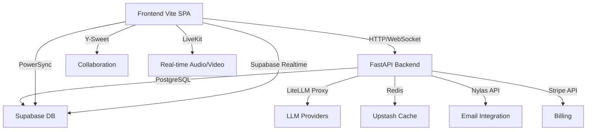

## TL;DR

**Platform**: AI Command Center - multi-domain SaaS platform with frontend (Vite SPA), backend (FastAPI), and multi-tenant database (Supabase PostgreSQL).

**Key decisions**: Vite SPA only (no Next.js), Zustand v5 for global state, LiteLLM proxy for all AI calls, PowerSync for offline sync, Y-Sweet for collaboration, LiveKit v2.0 for real-time.

**Technology constraints**: See rule IDs below. All AI calls through LiteLLM (#BE-01), Prisma client never in browser (#BE-02), Nylas API only from FastAPI (#BE-03), Vercel Edge Functions no direct DB access (#BE-04).

**Domain ownership**: Six-domain architecture (Platform foundation, Data & sync, AI core, Frontend/UX, Security/governance, Business strategy). See [11-STRAT-BLUEPRINT.md](11-STRAT-BLUEPRINT.md).

**Rule references**: All architecture rules defined in [00-RULES.yaml](00-RULES.yaml). Key rules: #BE-01 through #BE-16 (backend), #FE-01 through #FE-08 (frontend), #COLL-01 through #COLL-03 (collaboration).

**Inter-domain dependencies**: Frontend depends on FastAPI backend, backend depends on Supabase DB, all domains integrate with AI core via LiteLLM. See dependency graph below.

## Domain dependency graph

---

## Architecture rules

All architecture rules defined in [00-RULES.yaml](00-RULES.yaml). Key rules: #BE-01 through #BE-16 (backend), #FE-01 through #FE-08 (frontend), #COLL-01 through #COLL-03 (collaboration).

---

## 1. System context (C1)

The system interacts with multiple external actors and services:

- **Users**: Access the platform via browser and mobile applications
- **External APIs**: LLM providers (Claude, OpenAI, Gemini), Stripe for billing, Nylas for email
- **Supabase**: Provides database and real-time infrastructure

## 2. Container level (C2)

The platform consists of these high-level containers:

| Container | Technology | Purpose |
| --- | --- | --- |
| Web Application | Vite SPA | React frontend with TypeScript |
| API Backend | FastAPI | Python backend handling business logic |
| Primary Database | Supabase PostgreSQL | Main application data with RLS |
| Time-Series DB | TimescaleDB | AI cost tracking and analytics |
| Cache | Redis (Upstash) | Rate limiting and semantic caching |
| Real-time Communication | LiveKit | Video conferencing and voice AI |

## 3. Deployment environments

For detailed deployment configurations, see [38-ARCH-DEPLOYMENT.md](38-ARCH-DEPLOYMENT.md).

## 4. Data flow architecture

For detailed system-level data flows between components, see [02-ARCH-FLOWS.md](02-ARCH-FLOWS.md#system-level-data-flows).

## 5. Security architecture

The platform implements defense in depth with 12 security layers covering network
isolation, application security, API protection, authentication, data access, supply
chain security, MCP security, AI guardrails, secret management, compliance, privacy,
and audit logging.

For detailed specifications of each security layer, including mechanisms, test methods,
and ownership, see [35-ARCH-SECURITY.md](35-ARCH-SECURITY.md).

## 6. Authentication & authorization

### 6.1 Login

- **Provider**: Supabase Auth with email/password
- **Token Hook**: `custom_access_token_hook` embeds `org_id` and `role` in JWT
- **Security**: JWT tokens are httpOnly, not stored in localStorage

### 6.2 Multi-factor authentication (MFA)

#### 6.2.1 TOTP

- **Implementation**: Spectrum TOTP
- **Backup**: Recovery codes provided on enrollment

#### 6.2.2 WebAuthn passkeys

- **Implementation**: SimpleWebAuthn (ADR107)
- **Storage**: `webauthn_challenges` table
- **Flow**: RPC-based authentication flow
- **Features**:
  - Cross-device QR code support
  - Recovery codes for account recovery

### 6.3 Organization switching

- **Mechanism**: `supabase.auth.refreshSession()`
- **Cleanup**: Query client cache cleared
- **Reconnection**: Realtime reconnection triggered
- **Rule**: AUTHHOOK01 compliance

### 6.4 Nylas authentication

- **Protocol**: OAuth2 grant flow
- **Expiration**: `grant.expired` webhook triggers re-authentication
- **Window**: Must complete re-auth within 72 hours
- **Monitoring**: Daily cron job checks for expiring grants

## 7. Infrastructure & SLAs

| Component | Provider | SLA | Backup Strategy | Disaster Recovery | Monitoring |
| --- | --- | --- | --- | --- | --- |
| FastAPI | Fly.io | 99.9% | Daily pg_dump, hourly WAL | Region failover | Sentry + Loki |
| Web App | Vercel | 99.9% | Git versioning | Global CDN | Vercel Analytics |
| Supabase DB | Supabase | 99.9% | PITR, 7-day retention | Cross-region replica | Supabase |
| TimescaleDB | Supabase | 99.9% | Continuous aggregates backup | Read replica | Supabase |
| Redis | Upstash | 99.9% | Persistence enabled, AOF | Multi-AZ | Upstash Dashboard |
| LiveKit | LiveKit | 99.9% | Recording retention | Region failover | LiveKit Dashboard |
| Vault | HashiCorp | 99.9% | Auto-unseal, RAID storage | Disaster recovery | Vault UI |
| Doppler | Doppler | 99.9% | Secret versioning | Geo-redundant | Doppler Dashboard |

## 8. Third-party integrations

| Service | Protocol | Authentication | Rate Limit | Retry Policy | Timeout | Circuit Breaker |
| --- | --- | --- | --- | --- | --- | --- |
| LiteLLM | HTTP | API key | 100 req/min | Exponential backoff 3x | 30s | Opens after 5 failures |
| Nylas | HTTP | OAuth2 | 100 req/min | Linear backoff 1s | 10s | Opens after 3 failures |
| Stripe | HTTP | API key | 100 req/min | Exponential backoff 2x | 30s | Opens after 5 failures |
| LiveKit | WebSocket | Token TTL 6h | - | - | - | - |
| Supabase Realtime | WebSocket | JWT | 100 channels/connection | 1s,2s,4s,8s,30s | - | - |
| Upstash Redis | TCP | TLS | 10,000 ops/sec | - | 5s | Opens after 10 failures |
| OTel Collector | HTTPS | OTLP | - | Exponential backoff 2x | 10s | Opens after 3 failures |
| Sentry | HTTPS | DSN | - | - | 5s | Opens after 5 failures |
| PostHog | HTTPS | API key auth | 1000 events/min | Linear backoff 500ms | 10s | Opens after 3 |

## 9. Auto-scaling configuration

| Service | Metric | Threshold | Scale Up Action | Scale Down Action | Max | Min |
| --- | --- | --- | --- | --- | --- | --- |
| FastAPI | CPU | 70% | Add 1 VM | Remove 1 VM | 10 | 1 |
| FastAPI | Memory | 80% | Add 1 VM | Remove 1 VM | 10 | 1 |
| Supabase DB | Connections | 80% | Add read replica | - | - | - |
| Supabase Realtime | Channels | 100/connection | Add capacity | - | - | - |
| Upstash Redis | Memory | 70% | Scale cluster | - | - | - |
| LiveKit | Participants | 1000 | Add SFU | Remove SFU | - | - |

## 10. Multi-region architecture

FastAPI uses active-passive deployment with pre-deployed infrastructure in passive region and data replication for tight RTO/RPO. Database replication uses streaming WAL changes from primary to replica with file-based fallback. Typical cross-region lag: 100-500ms. RTO ≤5min with proper configuration.

For detailed multi-region deployment patterns, see [38-ARCH-DEPLOYMENT.md](38-ARCH-DEPLOYMENT.md).

## 11. High availability & disaster recovery

For detailed disaster recovery procedures, runbooks, and incident response, see
[08-OPS-MANUAL.md](08-OPS-MANUAL.md).

## 12. SOC2 automation

For detailed SOC2 automation implementation, evidence collection pipelines, and control
mapping, see [35-ARCH-SECURITY.md](35-ARCH-SECURITY.md).

## 13. Container scanning

For detailed container scanning implementation, Grype vs Trivy comparison, and CI
integration patterns, see [35-ARCH-SECURITY.md](35-ARCH-SECURITY.md).

## 14. Technology stack by domain

For detailed technology choices for each domain, see [11-STRAT-BLUEPRINT.md](11-STRAT-BLUEPRINT.md#technology-stack).

This section covers:

- Domain A: Platform foundation & developer experience
- Domain B: Data, sync & knowledge
- Domain C: AI core & agent architecture
- Domain D: Frontend, UX & multimodal interfaces
- Domain E: Security, compliance & governance
- Domain F: Business strategy & monetization
